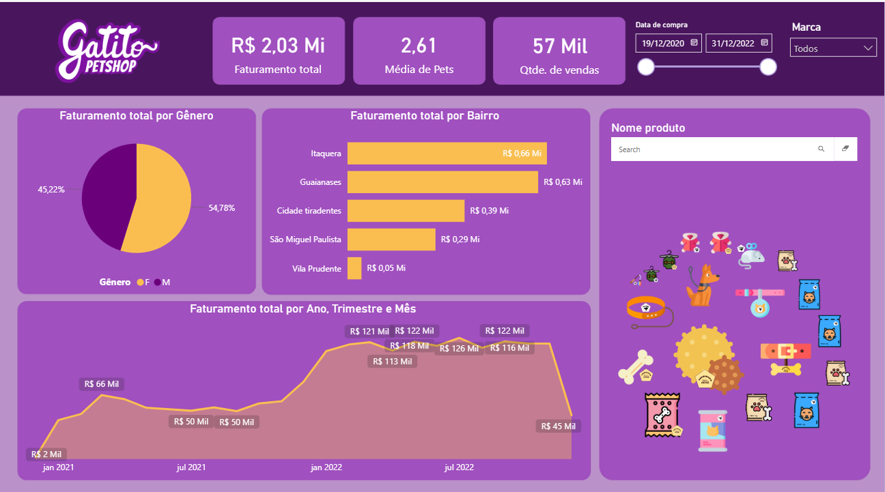

# Portfólio de Business Intelligence - Guilherme Lima

Bem-vindo ao meu portfólio de dados. Abaixo estão os projetos desenvolvidos com foco em análise de performance, KPIs financeiros e estratégia de negócios.

---

## 1. Dashboard Executivo de Vendas (E-commerce)
**Foco:** Monitoramento de KPIs macroeconômicos e performance regional.

> **Destaques:**
> * Monitoramento de Receita Total (165 Mi) e Margem de Lucro (57%).
> * Design em *Dark Mode* para visualização executiva de alto contraste.
> * Análise geográfica de vendas para identificar regiões estratégicas.

---

## 2. Case Café Serenatto (Gestão Financeira)
**Foco:** Análise de produtividade da equipe e eficiência operacional.

> **Destaques:**
> * Comparativo de rentabilidade do negócio x Investimentos (Selic).
> * Análise detalhada de custos de contratação (PF vs PJ).
> * Data Storytelling aplicado para facilitar a tomada de decisão da diretoria.

---

### 🛠 Ferramentas Utilizadas
* **Microsoft Power BI** (DAX, Power Query, Visualização)
* **Excel Avançado** (Tratamento de dados)
